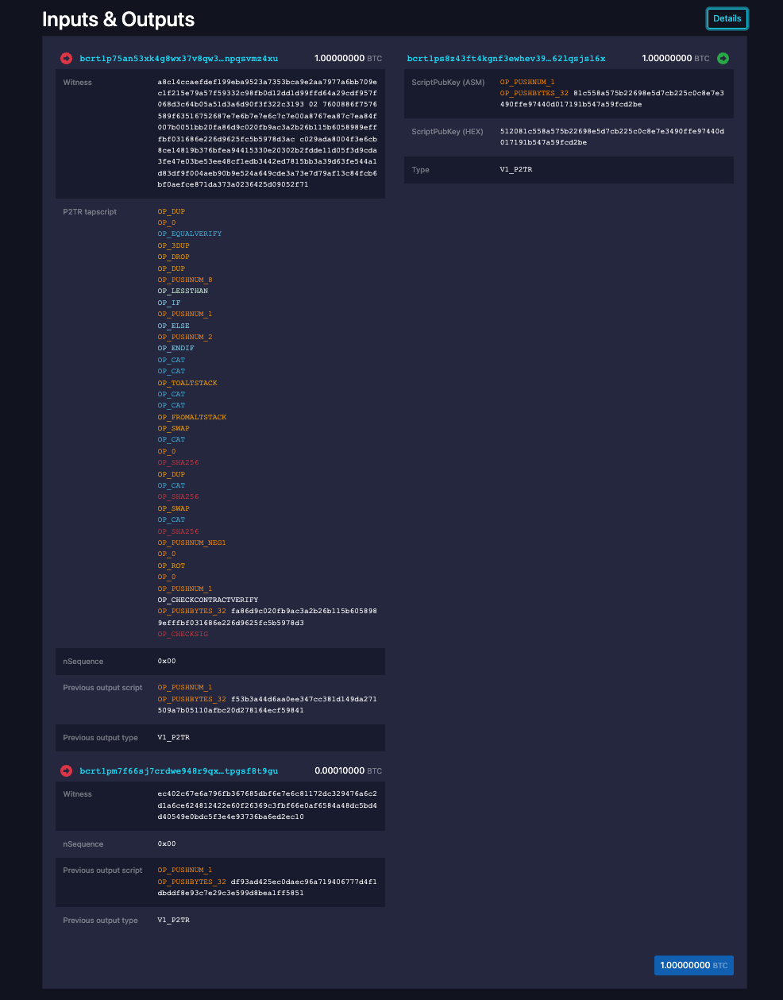

# mattlab

See [docs/challenge.md](docs/challenge.md) for a detailed walkthrough.

Build docker image:
```
$ docker build -f ./docker/Dockerfile -t matt-scenario .
```

From `docker/`:
```
$ TRACE_FILE="correct_trace.txt" docker-compose up
```

Now go to `localhost:80` to check out the transactions posted to the running
regtest blockchain: 


